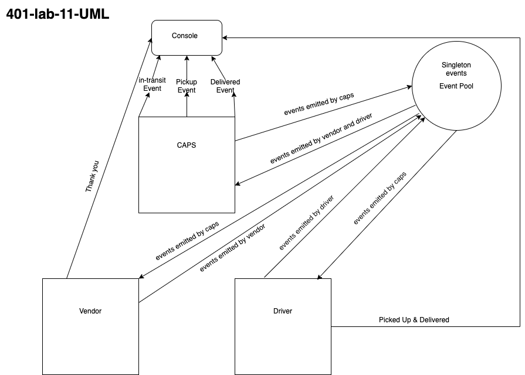

# LAB - Class 11

## Project: CAPS

### Author: Simon Panek

### Links and Resources

- [GitHub Actions](http://xyz.com) (GitHub Actions)

### Setup

#### `.env` requirements (where applicable)

- STORE=FlowerPower

#### How to initialize/run your application (where applicable)

- `npm caps.js`

#### Tests

- `npm test`
- Tests check for the console logs related to `pickup-ready` (which should produce two different logs) and `delivered-ready`.

#### UML

