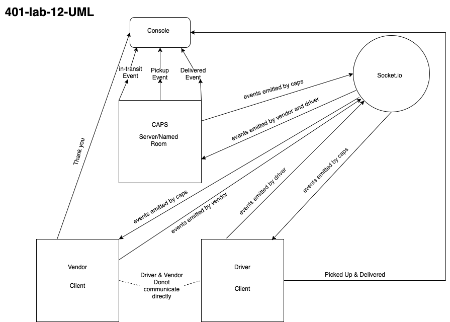

# LAB - Class 11

## Project: CAPS

In this project a parcel management service orchestrates communication between vendors and drivers using socket.io.

### Author: Simon Panek

#### Collaborators: Nathan Cox, Ricardo Barcenas, Mariko Alvarado

### Links and Resources

- [GitHub Actions](https://github.com/simon-panek/caps/actions)

### Setup

#### `.env` requirements (where applicable)

- STORE=FlowerPower

#### How to initialize/run your application (where applicable)

- `npm caps.js`

#### Tests

- `npm test`
- Tests check for the console logs related to `pickup-ready` (which should produce two different logs) and `delivered-ready`.

#### UML

